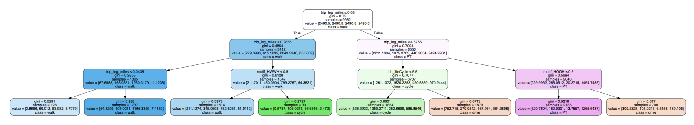

# Activity scheduler and mode choice model
The nhtsSimple.py script uses data from the National House Travel Survey to calibrate a simple activity-based mobility model. 

## Inputs

blocks: an object which defines a set of city blocks and the number of people of each occupation type working in each block. The occupation types are:

|1	| Sales or service										| 
|---|-------------------------------------------------------|
|2	| Clerical or administrative 							|
|---|-------------------------------------------------------|
|3	| Manufacturing, construction, maintenance, or farming	| 
|---|-------------------------------------------------------|
|4	| Professional, managerial, or technical 				|

maxDepth: the maximum depth of the decision tree which will be used to predict mode choice for each choice. This also corresponds to the number of if-else statements required to make the mode choice prediction.

## Outputs

simPop.csv is a dataframe containing the synthetic population corresponding to each defined block. This includes personal characteristics of the population as well as a mobility motif for each person.

treeModeSimple.pdf is a visualisation of the calibrated decision tree for predicting mobility mode choice. The four possible options are as follows:

| 0       | 1       | 2       | 3       |
|---------|---------|---------|---------|
| driving | cycling | walking | transit |

An example tree is shown below.

modeChoice.py contains python code for the series of if -else statements corresponding to the calibrated decision tree. This script is created by running the nhtsSimple.py script. 
